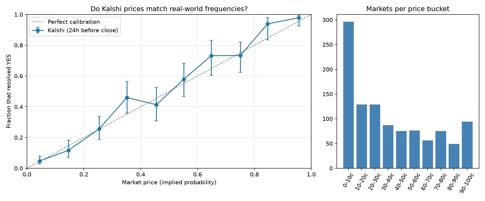

# Are Kalshi Prices Accurate Probabilities?

A calibration study of the Kalshi prediction market: when Kalshi prices an event at X%, does it happen X% of the time, and could anyone profit from the gaps after real trading costs?

Full write-up: [report.pdf](report.pdf)

## Key findings

Across 1,066 settled Kalshi markets (376 events), using the mid price 24 hours before close:

1. **Prices are very well calibrated.** Calibration error (Brier reliability) was 0.0021, against 0.1057 resolution. Contracts priced around 4% resolved YES 4.7% of the time.
2. **No favorite–longshot bias.** The longshot gap (actual YES rate minus price, contracts under 15¢) was +0.000, 95% CI −0.022 to +0.026. Recalibration slope 1.085 (95% CI 0.967 to 1.247).
3. **Accuracy improves near close.** On the same 176 markets, the Brier score fell from 0.1015 (7 days out) to 0.0963 (24 hours) to 0.0897 (1 hour), while calibration error stayed small: the gain comes from new information, not from a bias being corrected.
4. **No tradable edge after costs.** Both tested strategies lost money out of sample. The bid–ask spread cost about six times as much as Kalshi's fees.
5. **Overfitting caught.** A "back favorites" rule earned +6.1% (t = 4.1) in training and −1.6% on newer, unseen markets.



## Method in brief

- **Price:** mid price, (bid + ask) / 2, from hourly candlesticks at 1 hour, 24 hours and 7 days before close.
- **Filters:** spread at most 10¢, volume at least 10 contracts, markets open at least 30 hours; crypto and multi-leg combo markets excluded.
- **Inference:** markets in the same event are correlated, so all confidence intervals use a cluster bootstrap that resamples whole events.
- **Backtest:** trades pay the ask and Kalshi's taker fee, round_up(0.07 × C × P × (1 − P)); thresholds are chosen on the oldest 60% of markets and judged on the newest 40%.

## How to run

Requires Python 3.10+.

```bash
pip install -r requirements.txt
python step1_collect.py      # download markets and prices (about 30-45 min for 3,000 markets)
python step2_clean.py        # build data/analysis.csv
python step3_calibration.py  # calibration study -> results/summary.txt, figures/
python step4_backtest.py     # backtest -> results/backtest.txt
```

Settings (number of markets, snapshot times, filters, excluded categories) are at the top of each script. Only public market data is read; no Kalshi account or API key is needed. Data comes from the [Kalshi API](https://docs.kalshi.com/getting_started/historical_data).

## Repository layout

| File | Contents |
| --- | --- |
| `step1_collect.py` | Downloads series, settled markets and hourly candlesticks |
| `step2_clean.py` | Joins, filters and computes mid prices |
| `step3_calibration.py` | Calibration table, Brier and log loss, bias test, breakdowns, charts |
| `step4_backtest.py` | Fee- and spread-aware backtest with a time-based train/test split |
| `1_calibration.png` to `5_equity_curve.png` | Charts produced by steps 3 and 4 |
| `summary.txt`, `calibration_table.csv`, `backtest.txt` | Result numbers from steps 3 and 4 |
| `report.pdf` | Full research write-up |

When you run the scripts yourself, they save charts into `figures/` and results into `results/`.

The `data/` folder is not included because it is large; running step 1 rebuilds it.

## Limitations

- The sample is sports-heavy (Sports and Mentions are 67% of markets), so results describe those categories most.
- Sample sizes are modest: 176 markets in the horizon comparison, 28 and 57 out-of-sample trades.
- The backtest assumes 100-contract orders fill at the best ask.
